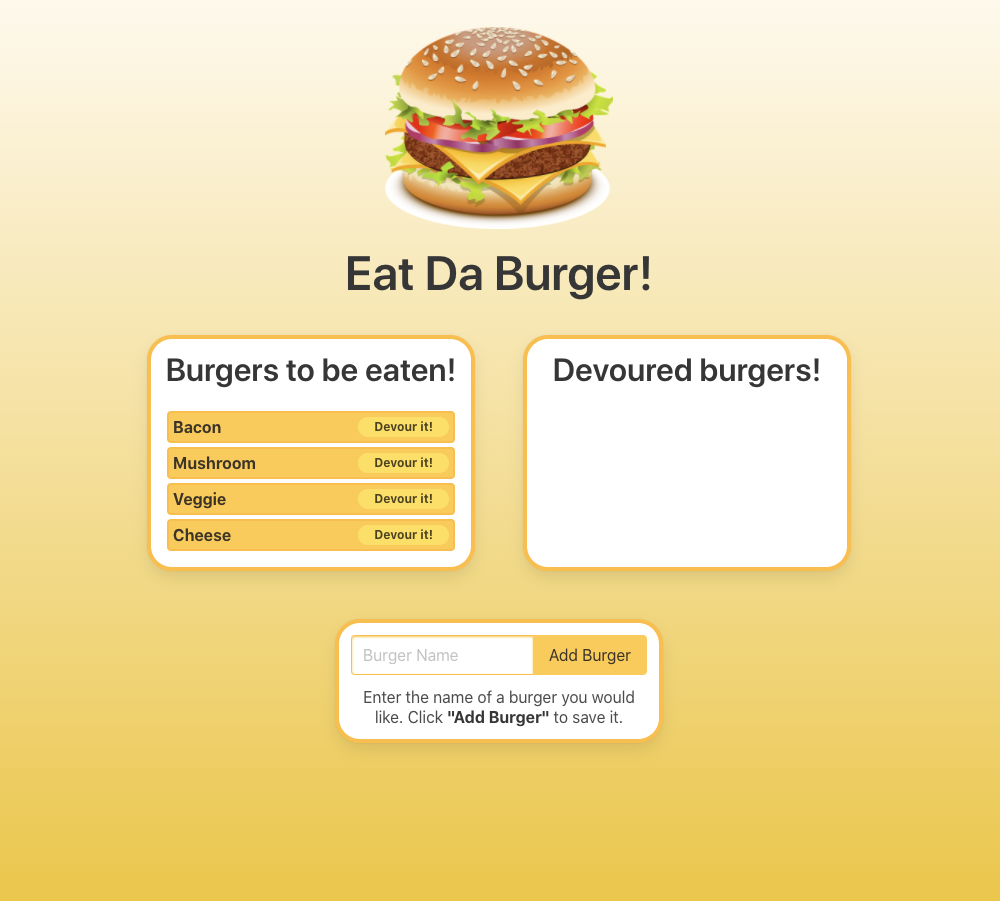

# Eat Da Burger

## Table of Contents

* [Description](#description)
* [Installation](#installation)
* [Usage](#usage)
* [License](#license)
* [Contributing](#contributing)
* [Tests](#tests)
* [Questions](#questions)

-----

## Description

This web application was a homework assignment designed to incorporate MySQL, Node, Express, Handlebars, and a homemade ORM using the MVC design pattern. To demonstrate these features, a website has been created to allow users to document and record burgers they would like to eat.

Example images:

-----

## Installation

This application is currently deployed to Heroku, and it can be accessed by clicking [here](https://tmk-eat-da-burger.herokuapp.com/). No further installation is needed.

-----

## Usage

The user can add new burgers to be eaten by typing in the Burger Name field and clicking Add Burger. When they want to "eat it," they click on the Devour It! button, which will move the burger to the container on the right to show it has been devoured.

-----

## License

This project does not have a license.

-----

## Contributing

This was a homework assignment, and therefore, I am not accepting contributions at this time.

-----

## Tests

There are no tests developed for this application; however, should you encounter any bugs while using the site, please feel free to contact me using the links below.

-----

## Questions

If you have any questions about this project, please free to contact me through my [Github profile](https://github.com/timothykemp) or via [email](mailto:timothymichaelkemp@gmail.com).
  